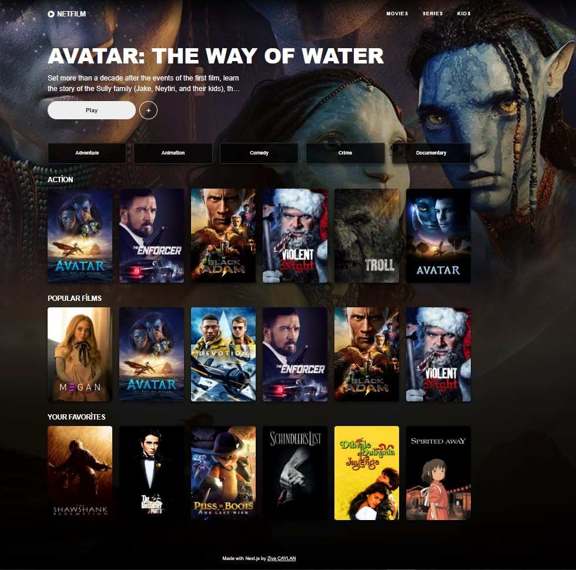

This is a [Next.js](https://nextjs.org/) project bootstrapped with [`create-next-app`](https://github.com/vercel/next.js/tree/canary/packages/create-next-app).

## Getting Started

First, run the development server:

```bash
npm run dev
# or
yarn dev
# or
pnpm dev
```

Open [http://localhost:3000](http://localhost:3000) with your browser to see the result.

You can start editing the page by modifying `app/page.jsx`. The page auto-updates as you edit the file.

[API routes](https://nextjs.org/docs/api-routes/introduction) can be accessed on [http://localhost:3000/api/hello](http://localhost:3000/api/hello). This endpoint can be edited in `pages/api/hello.js`.

The `pages/api` directory is mapped to `/api/*`. Files in this directory are treated as [API routes](https://nextjs.org/docs/api-routes/introduction) instead of React pages.

This project uses [`next/font`](https://nextjs.org/docs/basic-features/font-optimization) to automatically optimize and load Inter, a custom Google Font.

## Learn More

To learn more about Next.js, take a look at the following resources:

- [Next.js Documentation](https://nextjs.org/docs) - learn about Next.js features and API.
- [Learn Next.js](https://nextjs.org/learn) - an interactive Next.js tutorial.

You can check out [the Next.js GitHub repository](https://github.com/vercel/next.js/) - your feedback and contributions are welcome!

## Deploy on Vercel

## Demo : https://netfilm-app-ziyacaylan.vercel.app/

---

## Project Skeleton

```
|----README.md
├── app
│ ├── [[...category]]
│ │ ├── loading.js
│ │ └── page.js
│ ├── movie/[id]
│ │ ├── error.js
│ │ ├── loading.js
│ │ ├── not-found.js
│ │ └── page.js
│ └── loyout.jsx
├── assets
│   ├── netfilm-app-screenshot-1.jpg
│   └── netfilm-app-screenshot.jpg
├── components
│ ├── categories
│ │ ├── index.js
│ │ ├── loading.js
│ │ └── styles.module.css
│ ├── featured-movie
│ │ ├── index.js
│ │ ├── loading.js
│ │ └── styles.module.css
│ ├── footer
│ │ ├── index.js
│ │ └── styles.module.css
│ ├── header
│ │ ├── index.js
│ │ └── styles.module.css
│ ├── loading
│ │ ├── index.js
│ │ └── styles.module.css
│ ├── lmovie-section
│ │ ├── index.js
│ │ ├── loading.js
│ │ └── styles.module.css
│ └── skeleton
│   ├── index.js
│   └── styles.module.css
├── containers
│ ├── home
│ │ └── index.js
│ └── movie
│   └── index.js
├── mocks
│   ├── genres.json
│   └── movies.json
├── public
│ ├── favicon.ico
│ ├── next.svg
│ ├── thirteen.svg
│ └── vercel.svg
├── services
│ └── movie.js
├── styles
│ ├── global.css
│ └── reset.css
├── .env
├── .gitignore
├── jsconfig.json
├── next.config.js
├── package-lock.json
└── vpackage.json

```

---


